# Database ERD - Booking System (Laravel Backend)

## Entity Relationship Diagram

```mermaid
erDiagram
    %% Core User Entities
    COMPANIES ||--o{ LOCATIONS : has
    COMPANIES ||--o{ USERS : employs
    LOCATIONS ||--o{ USERS : has
    LOCATIONS ||--o{ PACKAGES : offers
    LOCATIONS ||--o{ ATTRACTIONS : has
    LOCATIONS ||--o{ ROOMS : contains
    
    %% User Management
    USERS ||--o{ BOOKINGS : creates
    USERS ||--o{ ACTIVITY_LOGS : generates
    USERS ||--o{ NOTIFICATIONS : receives
    
    %% Customer Management
    CUSTOMERS ||--o{ BOOKINGS : makes
    CUSTOMERS ||--o{ RESERVATIONS : has
    CUSTOMERS ||--o{ CUSTOMER_GIFT_CARDS : owns
    CUSTOMERS ||--o{ NOTIFICATIONS : receives
    
    %% Booking Flow
    BOOKINGS }o--|| PACKAGES : books
    BOOKINGS ||--o{ BOOKING_ATTRACTIONS : includes
    BOOKINGS ||--o{ BOOKING_ADD_ONS : includes
    BOOKINGS }o--|| ROOMS : reserves
    BOOKINGS }o--|| GIFT_CARDS : uses
    BOOKINGS }o--|| PROMOS : applies
    BOOKINGS ||--|| PAYMENTS : has
    
    %% Package & Attraction Management
    PACKAGES ||--o{ PACKAGE_ATTRACTIONS : contains
    PACKAGES ||--o{ PACKAGE_ADD_ONS : includes
    PACKAGES ||--o{ PACKAGE_GIFT_CARDS : offers
    PACKAGES ||--o{ PACKAGE_PROMOS : allows
    PACKAGES ||--o{ PACKAGE_ROOMS : reserves
    
    ATTRACTIONS ||--o{ BOOKING_ATTRACTIONS : booked_in
    ATTRACTIONS ||--o{ PACKAGE_ATTRACTIONS : included_in
    ATTRACTIONS ||--o{ ATTRACTION_PURCHASES : purchased_as
    
    %% Add-ons & Promotions
    ADD_ONS ||--o{ BOOKING_ADD_ONS : added_to
    ADD_ONS ||--o{ PACKAGE_ADD_ONS : included_in
    
    GIFT_CARDS ||--o{ CUSTOMER_GIFT_CARDS : owned_by
    GIFT_CARDS ||--o{ PACKAGE_GIFT_CARDS : included_in
    
    PROMOS ||--o{ PACKAGE_PROMOS : applies_to
    
    %% Companies Table
    COMPANIES {
        bigint id PK
        string company_name UK
        string email UK
        string phone
        text address
        int total_locations
        int total_employees
        enum subscription_plan "basic|premium|enterprise"
        enum subscription_status "active|inactive|trial"
        timestamp created_at
        timestamp updated_at
    }
    
    %% Locations Table
    LOCATIONS {
        bigint id PK
        bigint company_id FK
        string name
        string address
        string city
        string state
        string zip_code
        string phone
        string email
        string timezone
        boolean is_active
        timestamp created_at
        timestamp updated_at
    }
    
    %% Users Table (Admin, Manager, Attendant)
    USERS {
        bigint id PK
        bigint company_id FK "nullable"
        bigint location_id FK "nullable"
        string first_name
        string last_name
        string email UK
        string phone "nullable"
        string password
        enum role "company_admin|location_manager|attendant"
        string employee_id UK "nullable"
        string department "nullable"
        string position "nullable"
        string shift "nullable"
        json assigned_areas "nullable"
        date hire_date "nullable"
        enum status "active|inactive"
        timestamp last_login "nullable"
        timestamp email_verified_at "nullable"
        string invitation_token "nullable"
        timestamp invitation_expiry "nullable"
        timestamp created_at
        timestamp updated_at
    }
    
    %% Customers Table
    CUSTOMERS {
        bigint id PK
        string first_name
        string last_name
        string email UK
        string phone
        string password
        date date_of_birth "nullable"
        int total_bookings
        decimal total_spent
        timestamp last_visit "nullable"
        enum status "active|inactive"
        timestamp email_verified_at "nullable"
        string remember_token "nullable"
        timestamp created_at
        timestamp updated_at
    }
    
    %% Packages Table
    PACKAGES {
        bigint id PK
        bigint location_id FK
        string name
        text description
        string category
        text features
        decimal price
        decimal price_per_additional "nullable"
        int max_participants
        int duration
        enum duration_unit "hours|minutes"
        decimal price_per_additional_30min "nullable"
        decimal price_per_additional_1hr "nullable"
        enum availability_type "daily|weekly|monthly"
        json available_days "nullable"
        json available_week_days "nullable"
        json available_month_days "nullable"
        string image "nullable"
        boolean is_active
        timestamp created_at
        timestamp updated_at
    }
    
    %% Attractions Table
    ATTRACTIONS {
        bigint id PK
        bigint location_id FK
        string name
        text description
        decimal price
        enum pricing_type "per_person|per_unit|fixed|per_lane"
        int max_capacity
        string category
        string unit "nullable"
        int duration "nullable"
        enum duration_unit "hours|minutes|nullable"
        json availability "nullable"
        string image "nullable"
        decimal rating "nullable"
        int min_age "nullable"
        boolean is_active
        timestamp created_at
        timestamp updated_at
    }
    
    %% Rooms Table
    ROOMS {
        bigint id PK
        bigint location_id FK
        string name
        int capacity "nullable"
        decimal price "nullable"
        boolean is_available
        timestamp created_at
        timestamp updated_at
    }
    
    %% Add-ons Table
    ADD_ONS {
        bigint id PK
        bigint location_id FK "nullable"
        string name
        decimal price
        text description "nullable"
        string image "nullable"
        boolean is_active
        timestamp created_at
        timestamp updated_at
    }
    
    %% Gift Cards Table
    GIFT_CARDS {
        bigint id PK
        string code UK
        enum type "fixed|percentage"
        decimal initial_value
        decimal balance
        int max_usage
        text description
        enum status "active|inactive|expired|redeemed|cancelled|deleted"
        date expiry_date "nullable"
        bigint created_by FK "users.id"
        boolean deleted
        timestamp created_at
        timestamp updated_at
    }
    
    %% Promos Table
    PROMOS {
        bigint id PK
        string code UK
        string name
        enum type "fixed|percentage"
        decimal value
        date start_date
        date end_date
        int usage_limit_total
        int usage_limit_per_user
        int current_usage
        enum status "active|inactive|expired|exhausted"
        text description "nullable"
        bigint created_by FK "users.id"
        boolean deleted
        timestamp created_at
        timestamp updated_at
    }
    
    %% Bookings Table
    BOOKINGS {
        bigint id PK
        string reference_number UK
        bigint customer_id FK
        bigint package_id FK "nullable"
        bigint location_id FK
        bigint room_id FK "nullable"
        bigint created_by FK "users.id|nullable"
        bigint gift_card_id FK "nullable"
        bigint promo_id FK "nullable"
        enum type "package|attraction"
        date booking_date
        time booking_time
        int participants
        int duration
        enum duration_unit "hours|minutes"
        decimal total_amount
        decimal amount_paid
        decimal discount_amount "nullable"
        enum payment_method "credit|debit|cash|e-wallet|bank_transfer"
        enum status "pending|confirmed|checked-in|completed|cancelled"
        text notes "nullable"
        text special_requests "nullable"
        timestamp checked_in_at "nullable"
        timestamp completed_at "nullable"
        timestamp cancelled_at "nullable"
        timestamp created_at
        timestamp updated_at
    }
    
    %% Booking Attractions (Pivot)
    BOOKING_ATTRACTIONS {
        bigint id PK
        bigint booking_id FK
        bigint attraction_id FK
        int quantity
        decimal price_at_booking
        timestamp created_at
        timestamp updated_at
    }
    
    %% Booking Add-ons (Pivot)
    BOOKING_ADD_ONS {
        bigint id PK
        bigint booking_id FK
        bigint add_on_id FK
        int quantity
        decimal price_at_booking
        timestamp created_at
        timestamp updated_at
    }
    
    %% Package Attractions (Pivot)
    PACKAGE_ATTRACTIONS {
        bigint id PK
        bigint package_id FK
        bigint attraction_id FK
        timestamp created_at
        timestamp updated_at
    }
    
    %% Package Add-ons (Pivot)
    PACKAGE_ADD_ONS {
        bigint id PK
        bigint package_id FK
        bigint add_on_id FK
        timestamp created_at
        timestamp updated_at
    }
    
    %% Package Gift Cards (Pivot)
    PACKAGE_GIFT_CARDS {
        bigint id PK
        bigint package_id FK
        bigint gift_card_id FK
        timestamp created_at
        timestamp updated_at
    }
    
    %% Package Promos (Pivot)
    PACKAGE_PROMOS {
        bigint id PK
        bigint package_id FK
        bigint promo_id FK
        timestamp created_at
        timestamp updated_at
    }
    
    %% Package Rooms (Pivot)
    PACKAGE_ROOMS {
        bigint id PK
        bigint package_id FK
        bigint room_id FK
        timestamp created_at
        timestamp updated_at
    }
    
    %% Customer Gift Cards (Ownership)
    CUSTOMER_GIFT_CARDS {
        bigint id PK
        bigint customer_id FK
        bigint gift_card_id FK
        boolean redeemed
        timestamp redeemed_at "nullable"
        timestamp created_at
        timestamp updated_at
    }
    
    %% Reservations Table
    RESERVATIONS {
        bigint id PK
        string reference_number UK
        bigint customer_id FK
        bigint package_id FK
        bigint location_id FK
        date booking_date
        time booking_time
        int participants_count
        decimal total_amount
        enum status "confirmed|pending|cancelled|refunded"
        string payment_id
        text special_requests "nullable"
        timestamp created_at
        timestamp updated_at
    }
    
    %% Payments Table
    PAYMENTS {
        bigint id PK
        bigint booking_id FK "nullable"
        bigint customer_id FK
        string transaction_id UK
        decimal amount
        string currency
        enum method "credit|debit|cash|e-wallet|bank_transfer"
        enum status "pending|completed|failed|refunded"
        text notes "nullable"
        timestamp paid_at "nullable"
        timestamp refunded_at "nullable"
        timestamp created_at
        timestamp updated_at
    }
    
    %% Attraction Purchases Table
    ATTRACTION_PURCHASES {
        bigint id PK
        bigint attraction_id FK
        bigint customer_id FK
        bigint created_by FK "users.id|nullable"
        int quantity
        decimal total_amount
        enum payment_method "credit|debit|cash|e-wallet|bank_transfer"
        enum status "pending|completed|cancelled"
        date purchase_date
        text notes "nullable"
        timestamp created_at
        timestamp updated_at
    }
    
    %% Notifications Table
    NOTIFICATIONS {
        bigint id PK
        bigint user_id FK "nullable"
        bigint customer_id FK "nullable"
        enum user_type "admin|customer"
        enum type "system|booking|payment|staff|customer|promotion|gift_card|reminder"
        enum priority "low|medium|high|urgent|nullable"
        string title
        text message
        enum status "unread|read|archived"
        string action_url "nullable"
        string action_text "nullable"
        json metadata "nullable"
        string related_user "nullable"
        string related_location "nullable"
        timestamp read_at "nullable"
        timestamp created_at
        timestamp updated_at
    }
    
    %% Activity Logs Table
    ACTIVITY_LOGS {
        bigint id PK
        bigint user_id FK "nullable"
        bigint location_id FK "nullable"
        string action
        text details
        string ip_address "nullable"
        string user_agent "nullable"
        timestamp created_at
        timestamp updated_at
    }
```



## Database Tables Summary

### Core Tables (11)
1. **companies** - Multi-tenant company management
2. **locations** - Company branches/locations
3. **users** - Admin, Manager, Attendant accounts
4. **customers** - Customer accounts
5. **packages** - Booking packages
6. **attractions** - Individual attractions
7. **rooms** - Physical rooms/spaces
8. **add_ons** - Additional services
9. **gift_cards** - Gift card definitions
10. **promos** - Promotional codes
11. **bookings** - Main booking transactions

### Relationship Tables (7)
12. **booking_attractions** - Attractions in a booking
13. **booking_add_ons** - Add-ons in a booking
14. **package_attractions** - Attractions included in packages
15. **package_add_ons** - Add-ons available for packages
16. **package_gift_cards** - Gift cards applicable to packages
17. **package_promos** - Promos applicable to packages
18. **package_rooms** - Rooms available for packages

### Transaction Tables (6)
19. **customer_gift_cards** - Customer-owned gift cards
20. **reservations** - Customer reservations (legacy/alternative to bookings)
21. **payments** - Payment transactions
22. **attraction_purchases** - Direct attraction purchases
23. **notifications** - System notifications
24. **activity_logs** - Audit trail

## Key Relationships

### Multi-Tenancy
- Companies have multiple Locations
- Users belong to a Company and optionally a Location
- All operational data (Packages, Attractions, Rooms) belong to a Location

### User Types
1. **Company Admin** - Manages entire company
2. **Location Manager** - Manages specific location
3. **Attendant** - Handles bookings and customer service
4. **Customer** - End-user making bookings

### Booking Flow
```
Customer → Booking → Package/Attractions → Add-ons → Payment
                   ↓
              Gift Card / Promo (optional)
```

### Package Composition
```
Package contains:
  - Multiple Attractions
  - Multiple Add-ons (optional)
  - Available Gift Cards
  - Applicable Promos
  - Reserved Rooms
```

## Indexes Recommendations

```sql
-- Companies
CREATE INDEX idx_companies_status ON companies(subscription_status);

-- Locations
CREATE INDEX idx_locations_company ON locations(company_id);
CREATE INDEX idx_locations_active ON locations(is_active);

-- Users
CREATE INDEX idx_users_company_location ON users(company_id, location_id);
CREATE INDEX idx_users_role_status ON users(role, status);
CREATE INDEX idx_users_email ON users(email);

-- Customers
CREATE INDEX idx_customers_email ON customers(email);
CREATE INDEX idx_customers_status ON customers(status);

-- Bookings
CREATE INDEX idx_bookings_customer ON bookings(customer_id);
CREATE INDEX idx_bookings_location ON bookings(location_id);
CREATE INDEX idx_bookings_status ON bookings(status);
CREATE INDEX idx_bookings_date ON bookings(booking_date, booking_time);
CREATE INDEX idx_bookings_reference ON bookings(reference_number);

-- Packages
CREATE INDEX idx_packages_location ON packages(location_id);
CREATE INDEX idx_packages_category ON packages(category);
CREATE INDEX idx_packages_active ON packages(is_active);

-- Attractions
CREATE INDEX idx_attractions_location ON attractions(location_id);
CREATE INDEX idx_attractions_category ON attractions(category);
CREATE INDEX idx_attractions_active ON attractions(is_active);

-- Gift Cards & Promos
CREATE INDEX idx_gift_cards_code ON gift_cards(code);
CREATE INDEX idx_gift_cards_status ON gift_cards(status);
CREATE INDEX idx_promos_code ON promos(code);
CREATE INDEX idx_promos_status ON promos(status);
CREATE INDEX idx_promos_dates ON promos(start_date, end_date);

-- Notifications
CREATE INDEX idx_notifications_user ON notifications(user_id, user_type);
CREATE INDEX idx_notifications_customer ON notifications(customer_id);
CREATE INDEX idx_notifications_status ON notifications(status);

-- Activity Logs
CREATE INDEX idx_activity_logs_user ON activity_logs(user_id);
CREATE INDEX idx_activity_logs_location ON activity_logs(location_id);
CREATE INDEX idx_activity_logs_created ON activity_logs(created_at);
```

## Laravel Model Relationships Summary

### Company Model
```php
hasMany: Locations, Users
```

### Location Model
```php
belongsTo: Company
hasMany: Users, Packages, Attractions, Rooms, Bookings
```

### User Model
```php
belongsTo: Company, Location
hasMany: Bookings (as creator), ActivityLogs, Notifications
```

### Customer Model
```php
hasMany: Bookings, Reservations, Notifications, CustomerGiftCards, AttractionPurchases
belongsToMany: GiftCards (through CustomerGiftCards)
```

### Package Model
```php
belongsTo: Location
hasMany: Bookings
belongsToMany: Attractions, AddOns, GiftCards, Promos, Rooms
```

### Attraction Model
```php
belongsTo: Location
belongsToMany: Packages, Bookings
hasMany: AttractionPurchases
```

### Booking Model
```php
belongsTo: Customer, Package, Location, Room, GiftCard, Promo, User (creator)
belongsToMany: Attractions, AddOns
hasOne: Payment
```

### GiftCard Model
```php
belongsTo: User (creator)
belongsToMany: Packages, Customers
hasMany: CustomerGiftCards
```

### Promo Model
```php
belongsTo: User (creator)
belongsToMany: Packages
hasMany: Bookings
```

## Business Rules

1. **Multi-Tenancy**: All data is scoped by company_id and location_id
2. **Role Hierarchy**: Company Admin > Location Manager > Attendant
3. **Booking Status Flow**: pending → confirmed → checked-in → completed
4. **Gift Card**: Can be used once per booking, decrements balance
5. **Promo Code**: Limited by usage_limit_total and usage_limit_per_user
6. **Package Pricing**: Base price + (additional participants × price_per_additional)
7. **Attraction Pricing**: Varies by pricing_type (per_person, per_unit, fixed, per_lane)

## Migration Order

1. companies
2. locations
3. users, customers
4. packages, attractions, rooms, add_ons
5. gift_cards, promos
6. bookings
7. booking_attractions, booking_add_ons
8. package_attractions, package_add_ons, package_gift_cards, package_promos, package_rooms
9. customer_gift_cards
10. reservations, payments, attraction_purchases
11. notifications, activity_logs

